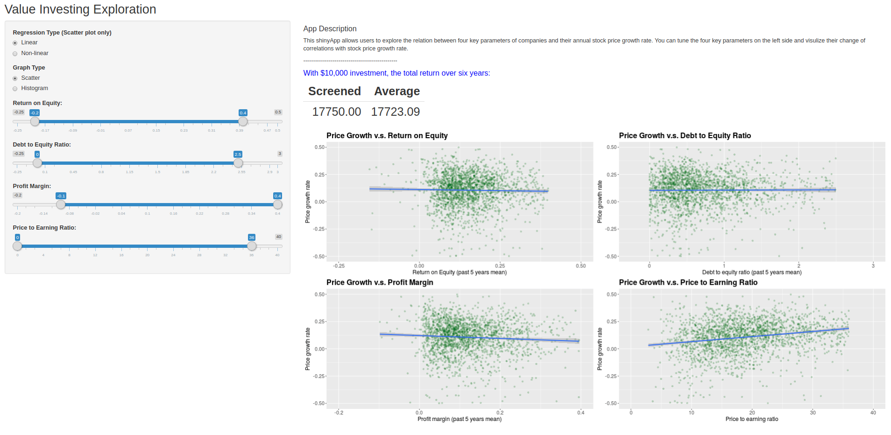

## Stock screening interactive shinyApp

Shun Chi

2018-01-28

This is a interactive shinyApp that allows people to explore the four key parameters and test empirically the value investing strategy in stock market.

App link: https://shunchi.shinyapps.io/stock_screening/

The four key parameters that can quantify the intrinsic value of a company are
* Return on Equity (ROE),
* Debt to Equity Ratio (DEratio),
* Profit Margin (Profit_Margin),
* Price to Earning ratio (PEratio).

On the left-hand side, the options for displaying graphs are provided: __scatter plot__ or __density plot__. In addition, the choices for the regression fits are also available for scatter plot. Users can modify the range of four key parameters using the sliders. The plots react accordingly. On top of the main panel, we showed the net asset if investing between 2011 and 2017 with the initial input of $10,000.

#### Scatter View

#### Density View

